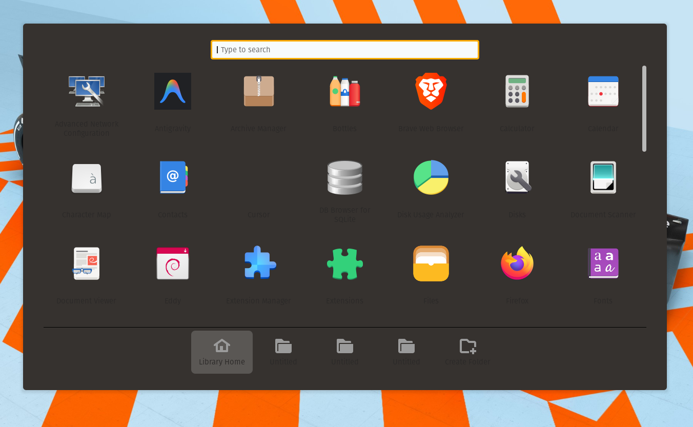
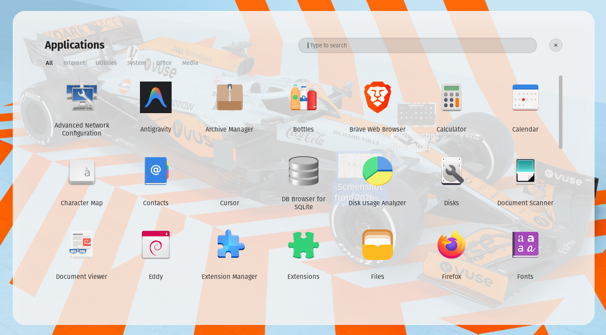

# Modern App Overlay for GNOME

A liquid glass-style app launcher for **Pop!_OS** (and GNOME 42+) — no extensions required, no theme managers, no bullshit. Direct edits to the system files that actually control the app tray.

---

## Before / After

| Before | After |
|--------|-------|
|  |  |

---

## What it does

- Replaces the default dark opaque app drawer with a **frosted glass panel**
- Adds an **"Applications" title** and a functional **× close button**
- Adds **category tabs** (All, Internet, Utilities, System, Office, Media) that actually filter apps by their `.desktop` categories
- Removes the clunky Library Home / folder bar from the bottom
- Makes app labels **larger and bolder** for readability
- Fully **reversible** — a backup of every modified file is created before touching anything

---

## Compatibility

| Distro | GNOME Shell | Status |
|--------|-------------|--------|
| Pop!_OS 22.04 | 42.x | ✅ Tested |
| Pop!_OS 22.04 (other themes) | 42.x | ✅ Works |
| Ubuntu 22.04 with pop-cosmic | 42.x | ⚠️ Untested |

> Requires `pop-cosmic@system76.com` extension to be present (it ships with Pop!_OS by default).

---

## Install

```bash
git clone https://github.com/Abijith616/Modern-App-Overlay-For-GNOME.git
cd Modern-App-Overlay-For-GNOME
chmod +x install.sh
./install.sh
```

That's it. The script will:
1. Detect your GNOME Shell version
2. Back up all files it touches
3. Apply the CSS and JS patches
4. Restart GNOME Shell automatically

---

## Uninstall

```bash
./uninstall.sh
```

Restores every original file from the backups created during install and restarts the shell.

---

## Files modified

| File | What changes |
|------|-------------|
| `/usr/share/gnome-shell/extensions/pop-cosmic@system76.com/dark.css` | Full CSS rewrite — glass background, search bar, icon cells, category tabs, title, close button |
| `/usr/share/gnome-shell/extensions/pop-cosmic@system76.com/applications.js` | Adds title, × button, category tab widgets + real filter logic. Hides folder bar. |
| `/usr/share/themes/Pop-dark/gnome-shell/gnome-shell.css` | Sets `.modal-dialog` background to transparent so the glass shows through |

---

## License

MIT — do whatever you want with it.
